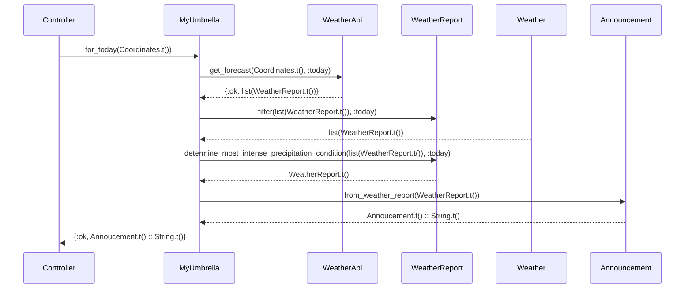

# My Umbrella: Do I need an umbrella today?


An example application for the presentation:

Beyond Mocks - Messing with Our Preconceptions of Testing

This application demonstrates various tactics for testing external, unstable dependencies, AKA
infrastructure. For the presentation, the focus is specifically on James Shore's technique,
_Nullables_ from the pattern language _Testing Without Mocks_.

## Example

```elixir
orlando = MyUmbrella.Coordinates.new(28.5383, -81.3792)
MyUmbrella.for_today(orlando)
#=> {:ok, "Thunderstorms! Take two umbrellas!"}
```

## Sequence Diagram


