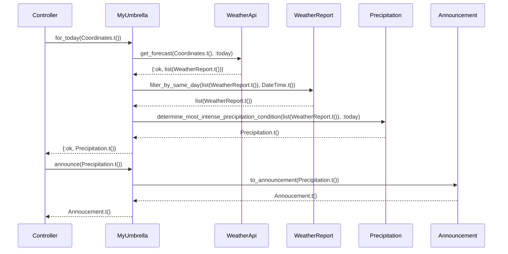

# My Umbrella: Do I need an umbrella today?


An example application for the presentation:

Beyond Mocks - Messing with Our Preconceptions of Testing

This application demonstrates various tactics for testing external, unstable dependencies, AKA
infrastructure. For the presentation, the focus is specifically on James Shore's technique,
_Nullables_ from the pattern language _Testing Without Mocks_.

## Example

```elixir
orlando = MyUmbrella.Coordinates.new(28.5383, -81.3792)
{:ok, weather} = MyUmbrella.for_today(orlando)
MyUmbrella.announce(weather)
#=> {:ok, MyUmbrella.Announcement{value: "Thunderstorms! Take two umbrellas!"}}
```

## Sequence Diagram



## Development

Prerequites:

- `asdf`: https://asdf-vm.com/
- `httpie`: https://httpie.io/cli
- Open Weather Map Application ID: https://openweathermap.org/

Setup:

```sh
git clone https://github.com/nicholasjhenry/my_umbrella.git
cd ./my_umbrella
asdf install
```

Testing:

```sh
mix test
```

Lint and type checks:

```sh
mix check
```

Run:

```sh
# terminal window: 1
export OPEN_WEATHER_MAP_APP_ID=YOUR_APP_ID
mix server

# terminal window: 2
script/request
```
